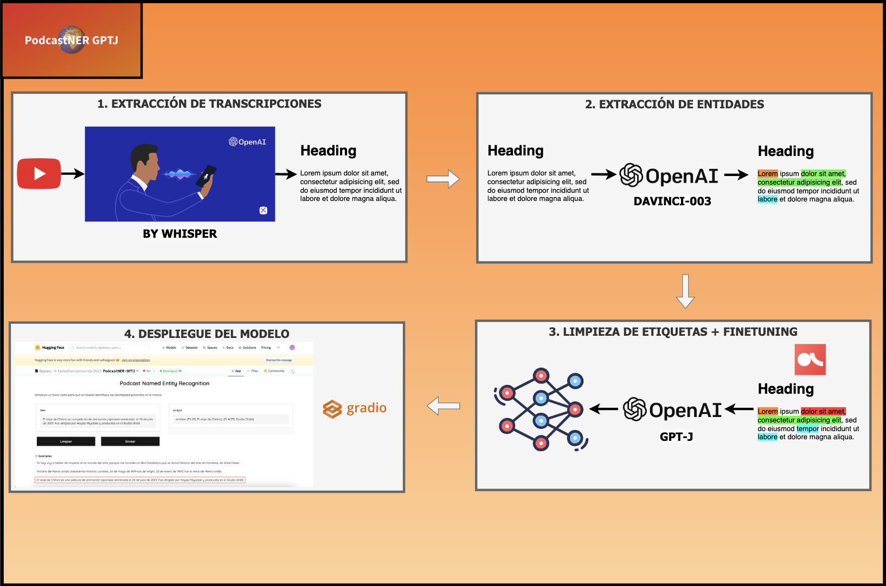

# PodcastNER - Hackathon SomosNLP 🤗
Transcribir podcasts en español y aplicar PLN para resumir y responder preguntas

<p align="center">
    
</p>

## Autores 👥:
* [Sergio Pérez](https://www.linkedin.com/in/sergiopp?originalSubdomain=uk)
* [David Mora](https://www.linkedin.com/in/davidfmora/)
* [Alberto Fernández](https://www.linkedin.com/in/alberto-fernandez-hernandez-3a3474136/)

## Resumen del proyecto

<p align="center">
    
</p>

1. Extracción de transcripciones de vídeos de YouTube. Herramientas empleadas:
    * 📚 [youtubesearchpython](https://pypi.org/project/youtube-search-python/): extracción de audio (formato .mp3)
    * 📚 [openai-whisper](https://github.com/openai/whisper): modelo transformer de "speech recognition"

2. Extracción de entidades a partir de las transcripciones anteriores. Herramientas empleadas:
    * 📚 [openai](https://pypi.org/project/openai/): obtención de entidades mediante _prompt engineering_. El modelo empleado ha sido __DaVinci003__
    ```
    Perform name entity recognition in Spanish. The classes are books, films, videogames, songs, places, dates, topics, organizations and people. 
    The output should follow the format: [{'class': 'people', 'text': "name of the person"}, {'class': 'books', 'start': 'name of the book}] 
    
    Sentence: 
    ```

3. Limpieza de las etiquetas + posterior _finetuning_. Herramientas empleadas:
    * 📚